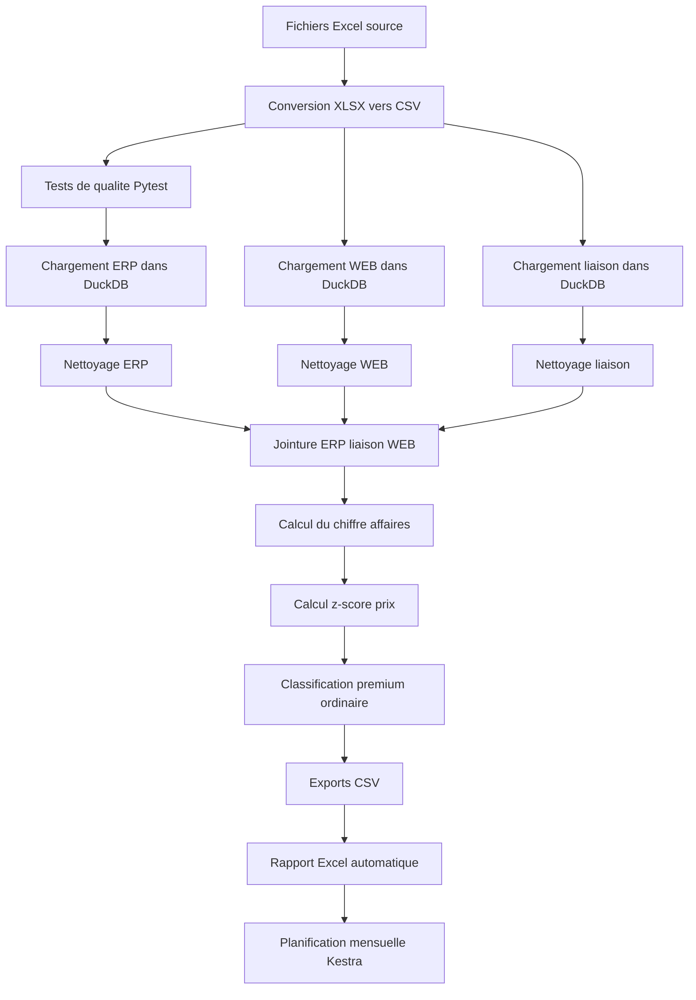

# Pipeline Kestra BottleNeck

Ce projet orchestre la reconciliation des donnees ERP et web avec Kestra, calcule le chiffre d'affaires par produit, classe les vins selon leur prix et genere un rapport Excel automatique.

## Lancer le pipeline

```bash
python3 -m venv .venv
source .venv/bin/activate
pip install -r requirements.txt
python xlsxtocsv.py
docker compose up
```

L'interface Kestra est disponible sur `http://localhost:8080`.

## Tests de qualite

Le flow Kestra execute `pytest` dans la tache `run_data_quality_tests` avant de construire les rapports. En cas d'echec d'un test, l'execution du pipeline echoue.

Pour les executer egalement en local :

```bash
pytest
```

Les tests verifient notamment la presence des colonnes attendues, la qualite des cles de jointure, la reconciliation ERP / WEB et le calcul du chiffre d'affaires.

## Succession des etapes du flow


